# Taizyd Korambayil SDGM-560 Blog
## Week 1 - Transition Effect Prototype _09/14/2018_

For the first week as we as a group decided on what the project would be and the kind of effect we are doing. Since we are dealing with 
a transition effect where a car transforms from and old model into another I decided to do a quick prototype shader in UE4 that we could use as a Previs element in out pitch.

The shader is essentially driven by a linear gradient generated from the Forward Vector of a Location Blueprint. The geometry is masked and swapped based on which side of the locator BP it is on.

**Shader Nodes**
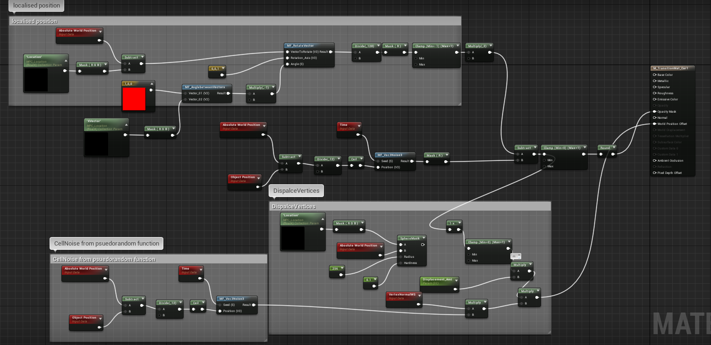

The Location of the Blueprint Actor is fed into the shader using a Material Parameter Collection fo Convenience.

**BP Locator Setup**

For the final effect we intend to make use of Houdini's game sheld tools to bake out Pivot Points and also bring in cached geometry animation from houdini and implement these in Unreal using shaders and Blueprints to drive them in real time.

**FX Reference**              
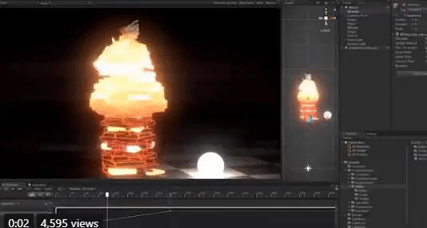 
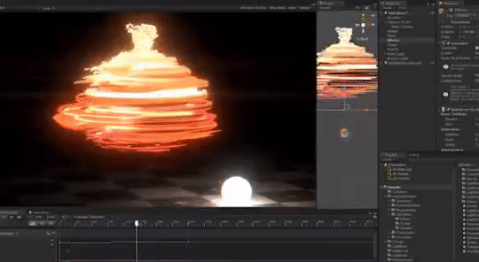
 
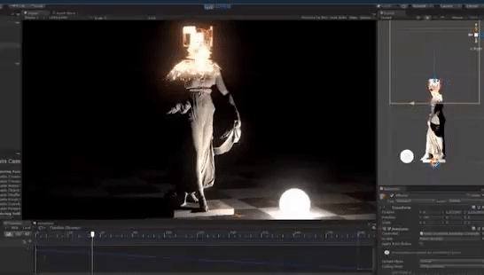
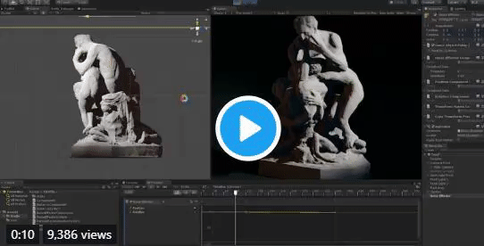 

  
## Week 2 - Pivot Painter R&D _09/25/2018_

This week I spent some time looking into the Game Shelf Tools in Houdini, specifically the **Pivot Painter SOP**. I used this tool to bake out seperate pivot locations for each poly on the surface of the car into the UV channels, and accessed them in unreal to create the dissappation effect. The limit with this effect is that it is dictated by the topology of the Mesh.

**Test on Car Model**
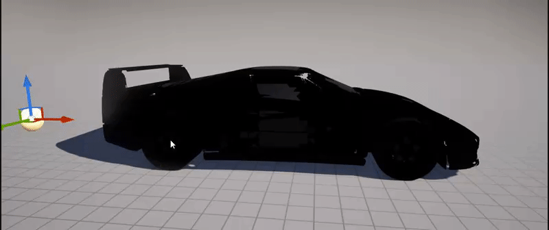

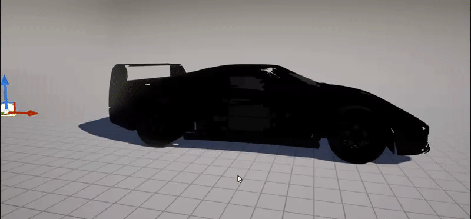

**Houdini Setup**
Below you can see the setup I am using to bake pivot locations to each face, I scatter points at the center of each poly, and transfer a name attribute to the points that make up each primitve so it knows which scattered point to use as it's pivot. The Pivot Painter SOP then bakes these locations into additional UV channels of the mesh.

**Network** 
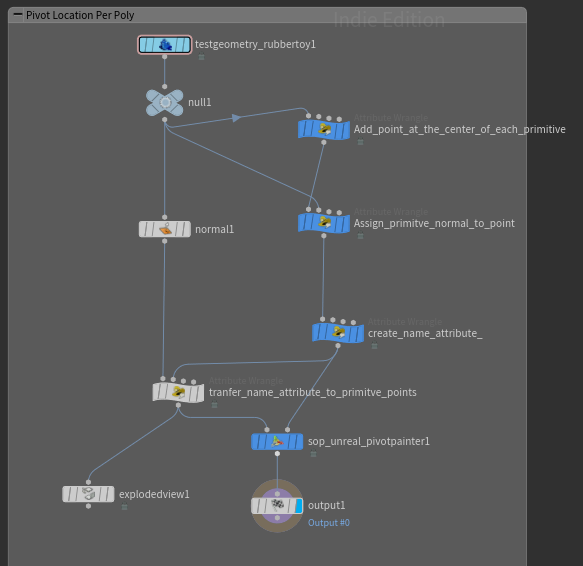
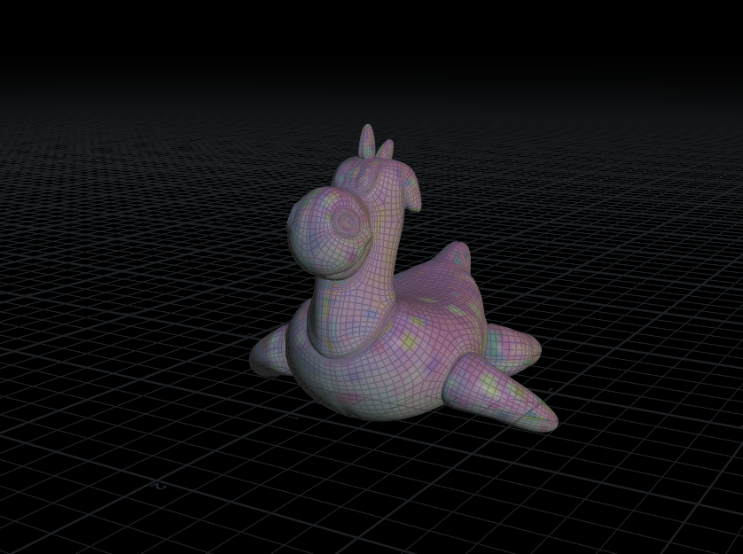

**Setup in Unreal Engine**
In Unreal I modified my Shader from last week to make use of the baked pivot locations to displace the polys based on the location of the blueprint to drive the Transition. There are Parameters to control Displacement Amt, Falloff and Effect Radius. 

Displacement Amt: 32
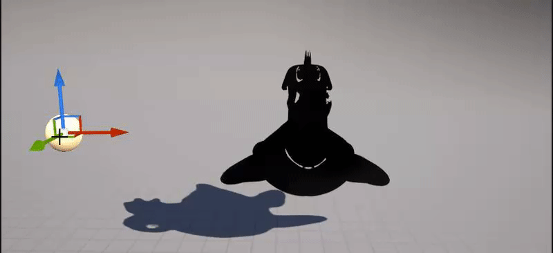

Displacement Amt: 512
 

Shader Network:
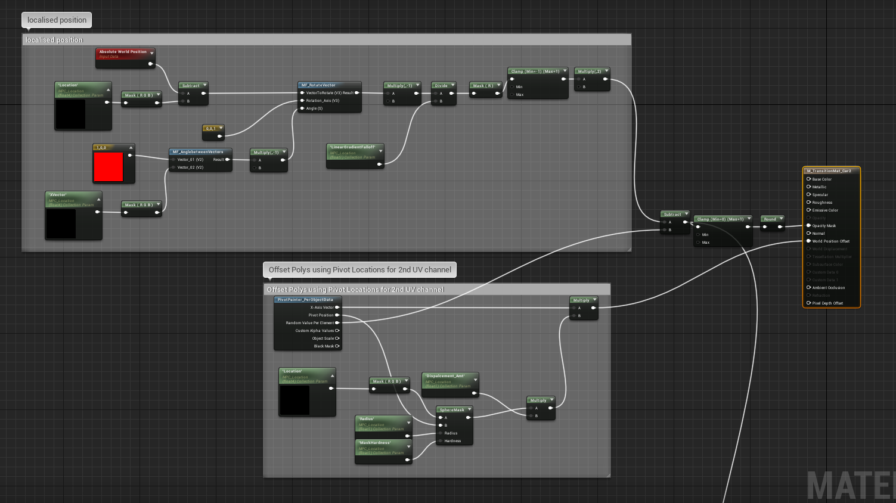

**Troubleshooting:**
The Pivot Painter SOP sometimes still exports geometry with incorrect Pivot Locations and flipped faces, resulting in unclean geometry inside unreal.

**Next Step:** 
1.Try and export pivot locations for each part of the car so that we can prototype the Disassmbly type effect that was suggested by Todd last week. 
2.Try exporting out vertex animations from houdini instead of driving the effect procedurally in unreal.

## Week 3 - FX Update, Piece chunking, Variation _10/02/2018_

This week I spent some trying to implement Todd's suggestion of having individual pieces of the car disassmble and reassemble. For this I needed to update my houdini setup to chunk pieces together and assign the same pivot location for each piece. I also tried a quick variation shader in UE4 where the car would swirl and morph into the other.

# Houdini Setup Update
I had modify my houdini setup to account for chunking and find a way to scatter the pivot location points at the center of each group.For now I am using spherical normals for the pivot direction, which is what casues all hte pieces to fly out in an outward spherical direction. Moving forward these will be grouped to work better gor how we want the effect to play out.
Groups Visualized:
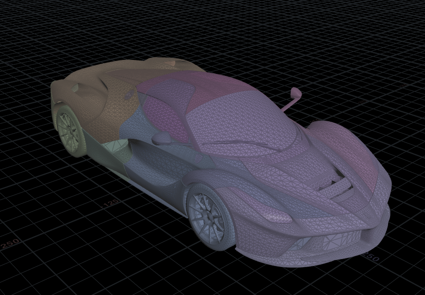
 Scattered Pivots Visualized:
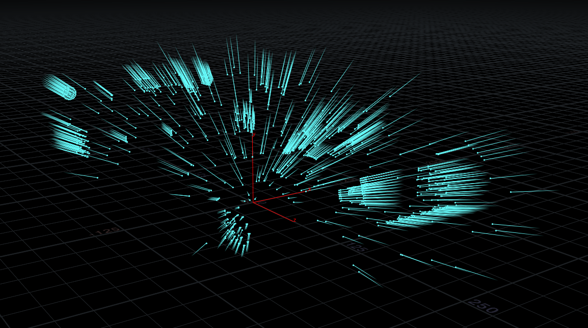

**Network** 

 Below is the VEX code that scatters points at the centroid of each group.
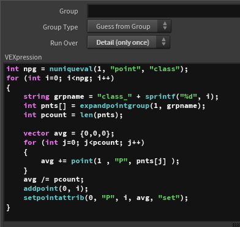
 And below is the VEX code for creating groups from attributes, in this case using the @class variable generated by the connectivity Node. 
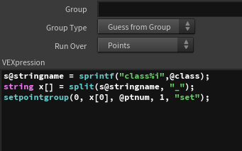
  
# UE4 Setup updates

In unreal I updated the technique I was using to drive the transition, instead of using the forward vector of one blueprint to drive the transition mask, I switched to using a linear gradient generated from the distance between a **BPstartLocator** and a **BPEndlocator**. This allowed to drive the transition from any 3 dimensional axis we want instead of being limited to the XY plane with the old technique.

Different Axis 

Influence Radius 

  
# Updated shader Network

I've updated the shader to have more parameters to control the final look of the effect in realtime, like influence radius, Displacement Amount, Enable/disable Rotation, Falloff etc.

**Shader Network**

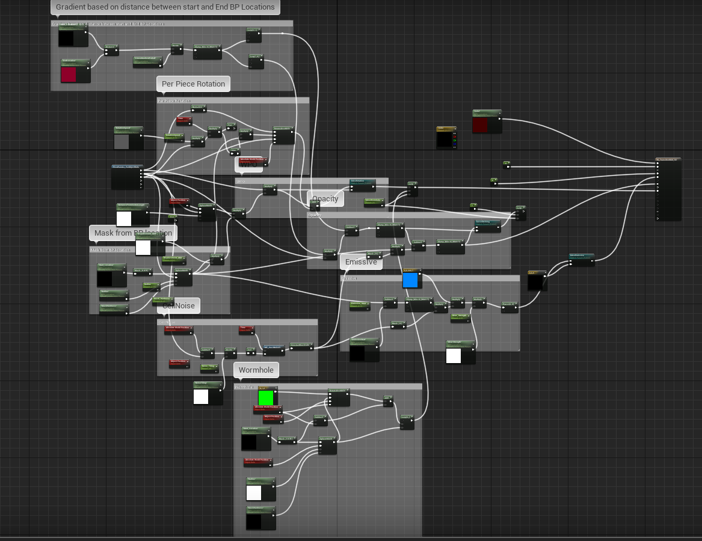

Parameter List: 
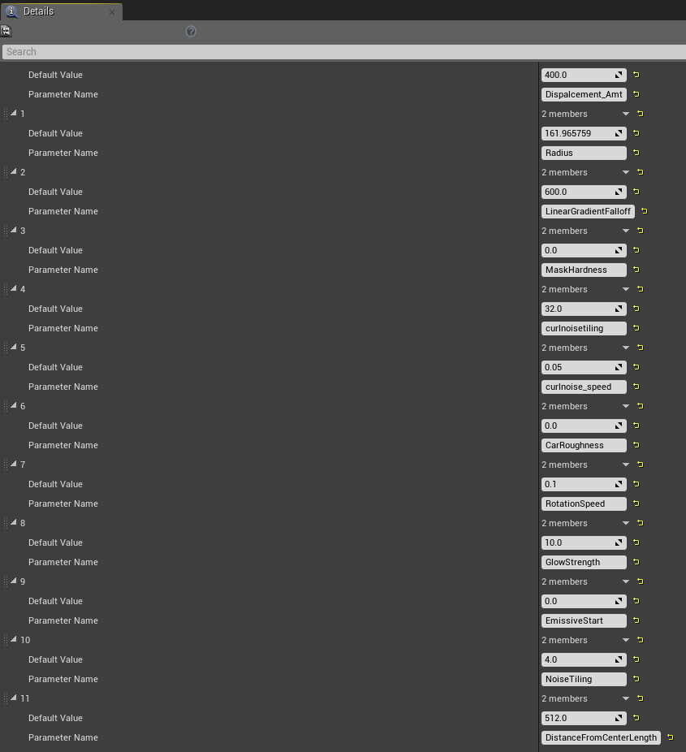
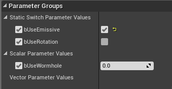

# Next Steps
1. Start Working on Look-Dev for the effect, more elements.
2. Wrap shader into Material Function for easy layering onto any surface shader
3. Try some more variations on transition effect
4. Try Simple composition in Nuke with shaded Models from Haley and Brian.
5. Implement feedback from this week.

 
